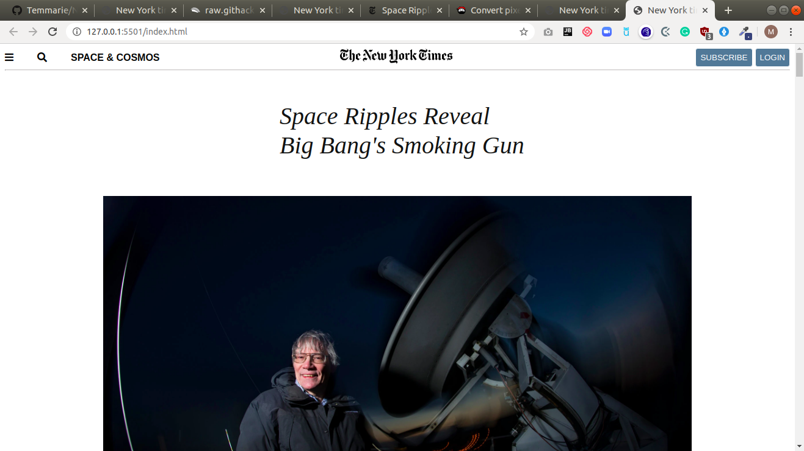

# NewYorkTimes-clone

This is the third project of the Main HTML/CSS curriculum at [Microverse](https:www.microverse.org/) - @microverseinc

# NewYorkTimes-clone ([The Odin Project](https://www.theodinproject.com/courses/html5-and-css3/lessons/positioning-and-floating-elements))

## Built With

- HTML5 
- CSS3

## Live Demo

[Live Demo](https://rawcdn.githack.com/Temmarie/NewYorkTimes-clone/455b01f342a22d20fc152611bfbb44dc5e2ae270/index.html)

## Authors

👤 **Grace Tamara Johnson E.**

- Github: [@Temmarie](https://github.com/Temmarie)

👤 **Marylene Sawyer**
- Github: [@Bluette1](https://github.com/Bluette1)

## 📝 License

This project is [MIT](https://opensource.org/licenses/MIT) licensed.